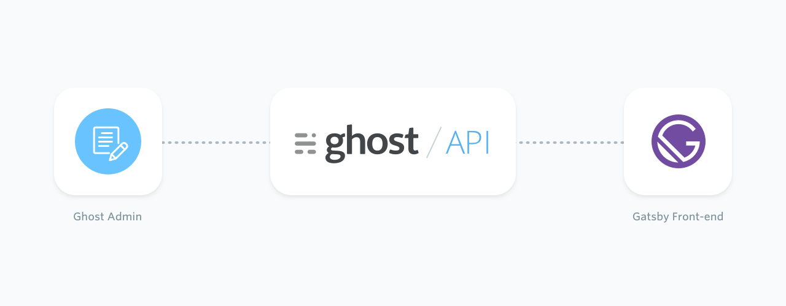

**Build a completely custom front-end to your Ghost site with the power of Gatsby!**

Thanks to the Content API, Ghost can operate as a [completely decoupled headless CMS](https://blog.ghost.org/jamstack/), allowing developers to build their own front-end with modern web technologies, such as [Gatsby.js](https://www.gatsbyjs.org/). The Ghost documentation site is built in the same manner, so you’re looking at proof that it really works!



The following sections cover how Gatsby can source content from a Ghost site, how to create a Gatsby site using our starter template, and some of the setup required to get you off to the races.

## Sourcing your content

**As with all content sources for Gatsby, content is fed in by [GraphQL](https://www.gatsbyjs.org/tutorial/part-four/), and it’s no different with Ghost. The official [Gatsby Source Ghost](https://github.com/TryGhost/gatsby-source-ghost) plugin allows you to pull content from your existing Ghost site.**

Installing the plugin is the same as any other Gatsby plugin. Use your CLI tool of choice to navigate to your Gatsby project and a package manager to install it:

``` bash
# yarn users
yarn add gatsby-source-ghost
# npm users
npm install --save gatsby-source-ghost
```

After that, the next step is to get API URL and Content API Key of the Ghost site.

The API URL is domain used to access the Ghost Admin, for Ghost(Pro) customers this is the `.ghost.io`, for example: `mysite.ghost.io`. For self-hosted versions of Ghost, use the admin panel access URL - ensure that the self-hosted version is served over a https connection. The Content API Key can be found on the Integrations screen of the Ghost Admin.

Open the `gatsby-config.js` file and add the following to the `plugins` section:

``` json
{
  resolve: `gatsby-source-ghost`,
  options: {
    apiUrl: `https://<your-site-subdomain>.ghost.io`,
    contentApiKey: `<your content api key>`
  }
}
```

Restart the local server to apply these configuration changes.

To learn more about the plugin, check out the [documentation within the repo on GitHub](https://github.com/TryGhost/gatsby-source-ghost#how-to-query). To delve deeper into writing GraphQL queries for Ghost, read our [documentation on the Content API](https://docs.ghost.org/api/content/) and find out more on the [official GraphQL docs](https://graphql.org/learn/queries/).

**Finding this all a little overwhelming? Don’t worry! You’re not alone. Thankfully, Ghost have contributed to the ever growing list of Gatsby Starters with a [Gatsby Starter Ghost](https://github.com/TryGhost/gatsby-starter-ghost) template That has pretty much everything to get you started, including the source plugin mentioned above.**

## Gatsby Starter Ghost

**One of the best ways to start a new Gatsby site is with a Gatsby Starter, and in this case, it’s no different.**

Before starting, download the Gatsby CLI tool with the following CLI command:

``` bash
install -g gatsby-cli
```

Next, pull down the official [Gatsby Starter Ghost](https://github.com/TryGhost/gatsby-starter-ghost) template directly from GitHub:

``` bash
gatsby new my-gatsby-site https://github.com/TryGhost/gatsby-starter-ghost.git
```

Navigate into the newly created project and use either `npm install` or `yarn` to install the dependencies. At Ghost, we prefer to use [Yarn](https://yarnpkg.com/en/docs/install#mac-stable).

Before customising and developing in this new Gatsby site, it’s wise to give it a test run to ensure everything is installed correctly. Because you installed the Gatsby CLI tool as part of the previous steps, you can now run `gatsby develop` in the project folder, which starts up the project and run it on your local machine.

Once everything is installed correctly, navigate to http://localhost:8000 in a browser and view the newly created Gatsby site.


## Making it your own

**So, you’ve set up a Gatsby site, but it’s not showing the right content.** This is where content sourcing comes into play. You may have seen in a previous section about our [Gatsby Source Ghost](https://github.com/TryGhost/gatsby-source-ghost) plugin, which can pull content into the Gatsby site from the Ghost Admin via the Content API.

The Gatsby Start Ghost template already has this built in; all it requires is some configuration. Within the project, navigate to the file `.ghost.json` at root level:

``` json
{
  "development": {
    "apiUrl": "https://gatsby.ghost.io",
    "contentApiKey": "9cc5c67c358edfdd81455149d0"
  },
  "production": {
    "apiUrl": "https://gatsby.ghost.io",
    "contentApiKey": "9cc5c67c358edfdd81455149d0"
  }
}
```

This file is set up to make environment variables a bit easier to control and edit. Change the `apiUrl` value to the URL of the site. For Ghost(Pro) customers, this is the Ghost URL ending in `.ghost.io`, and for people using the self-hosted version of Ghost, it’s the same URL used to view the admin panel.

In most cases, it’s best to change both the `development` and `production` to the same site details. However, when working with a development site, put those details into the `development` json object - it’s very useful when working with clients that are testing new content. Use the `production` details when deploying the site. After saving these changes, restart the local server.

**Using [Netlify](https://www.netlify.com/) to host your site? If so, the `netlify.toml` file that comes with the starter template provides the deployment configuration straight out of the box.**

## Next steps

Take a look at the [tutorials on the official Gatsby site](https://www.gatsbyjs.org/tutorial/) to help with developing in Gatsby.

Want to deploy the site to Netlify? Read our [documentation on Integrating with Netlify](https://docs.ghost.org/integrations/netlify/) and using Web Hooks with Ghost.

For community led support about linking and building a Ghost site with Gatsby, visit [the forum](https://forum.ghost.org/c/themes/).
